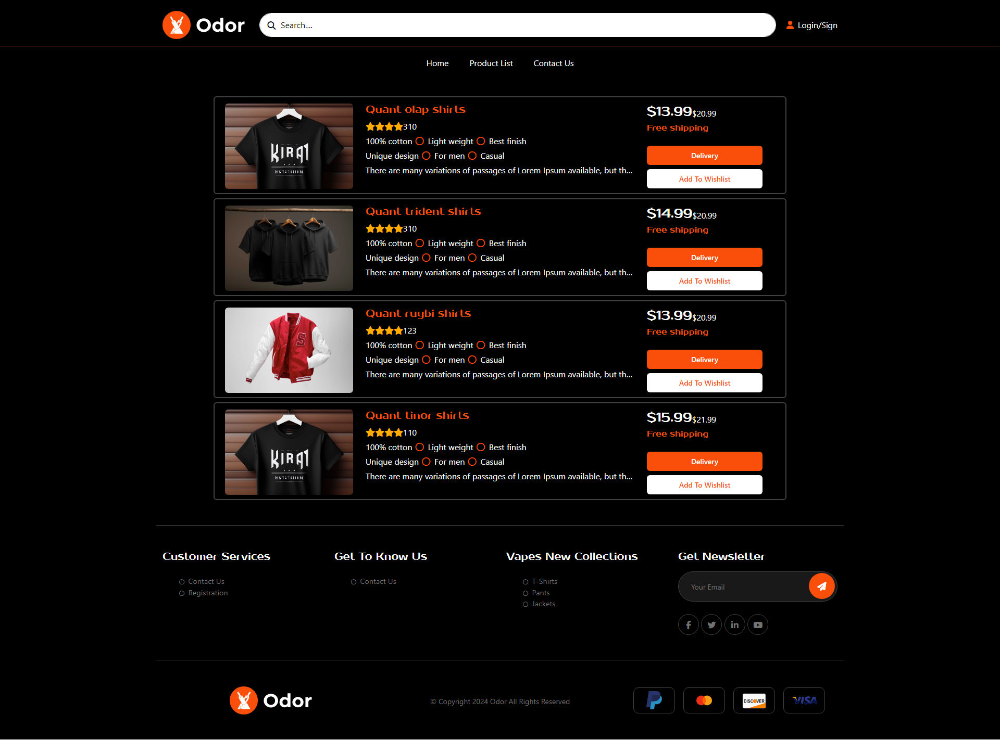
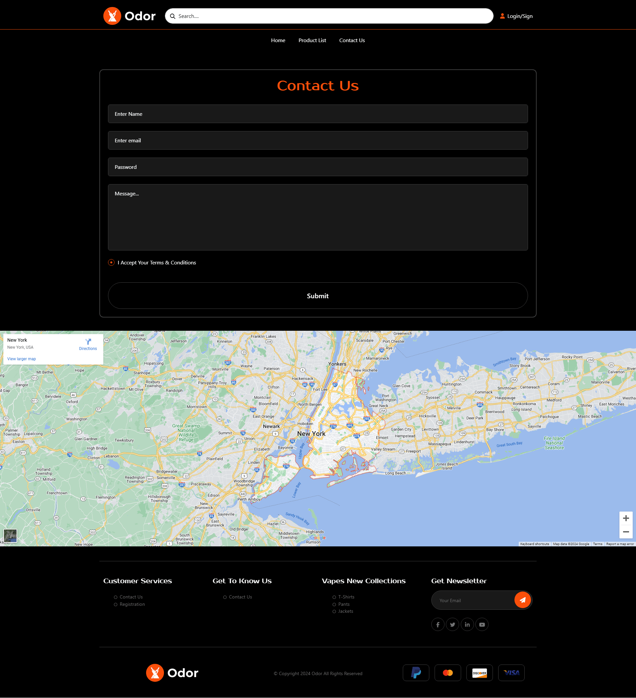

# Odor Men Clothing - Purchasing Cloth's

This is a web project i created during my semester project.

## Table of contents

- [Overview](#overview)
  - [The challenge](#the-challenge)
  - [Screenshot](#screenshot)
  - [Links](#links)
  - [Built with](#built-with)
  - [What I learned](#what-i-learned)
  - [Continued development](#continued-development)
  - [Useful resources](#useful-resources)
- [Author](#author)

## Overview

### The challenge

Users should be able to:

- View the optimal layout depending on their device's screen size
- See hover and focus states for interactive elements

### Screenshot

### Links

- Solution URL: [solution URL](https://github.com/irfan-hue/Responsive-Product-Preview-Card-Component)
- Live Site URL: [live site](https://irfan-hue.github.io/Responsive-Product-Preview-Card-Component)

### Built with

- Semantic HTML5 markup
- CSS custom properties
- Bootstrap
- Mobile-first workflow

### What I learned

To see how you can create a responsive website using bootstrap, see below:

If you want more help with writing markdown, we'd recommend checking out [w3schools](https://www.w3schools.com/) to learn more.

### Continued development

-My focus is still on moving forward in web development and learning new technologies.

### Useful resources

- [W3Schools](https://www.w3schools.com) - This helped me for media queries and making the design responsive. I really liked this pattern and will use it going forward.

## Author

- Social Links - [@rajairfanahmed](https://linktr.ee/rajairfanahmed)
- LinkedIn - [@rajairfanahmed](https://www.linkedin.com/in/rajairfanahmed/)
